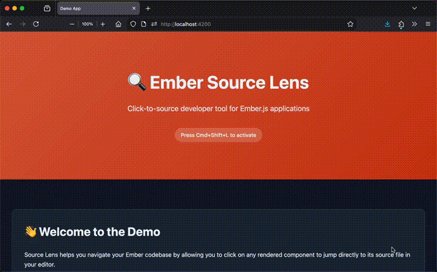

<center>

# 🔍 Ember Source Lens

**Click-to-source developer tool for Ember.js applications**



---

Ember Source Lens is a powerful development tool that lets you navigate your Ember codebase by clicking on any rendered component to jump directly to its source file in your editor. Perfect for large codebases where finding component definitions can be tricky.

</center>

## ✨ Features

- **🎯 Precise Navigation** - Click any component to jump directly to its source file, line, and column
- **⚡ IDE Integration** - Open the precise line in your editor.Supports VSCode, Cursor, WebStorm, Sublime Text, Windsurf, and more
- **🔥 Inline Editing** - Edit components in the inline editor
- **🎨 Visual Overlay** - Hover over elements to see highlighted component boundaries
- **⌨️ Keyboard Shortcut** - Quick toggle with `Cmd+Shift+L` (or `Ctrl+Shift+L` on Windows/Linux)
- **💾 State Persistence** - Remembers your last selected component across page reloads

## 📋 Requirements

- Ember.js v5.8 or above
- Usage of template tags for templates
- Vite for inline editing support

## 📦 Installation

```bash
pnpm add -D ember-source-lens
# or
npm install --save-dev ember-source-lens
# or
yarn add -D ember-source-lens
```

## 🚀 Quick Start

### 1. Add Babel Plugin

In your `babel.config.js`:

```js
const { sourceLens } = require('ember-source-lens/babel');

module.exports = {
  plugins: [
    // ...
    [
      'babel-plugin-ember-template-compilation',
      {
        transforms: [
          sourceLens.template(), // Add Source Lens Babel template plugin
        ],
      },
    ],
    sourceLens(), // add source lens babel plugin
    // ...
  ],
};
```

### 2. Add Component to Your Application

Add the `<SourceLens>` component to your application template:

```gjs
// app/templates/application.gjs
import { SourceLens } from 'ember-source-lens';

<template>
  {{outlet}}

  <SourceLens
    @editor="vscode"
    @projectRoot="/absolute/path/to/your/project"
  />
</template>
```

### 3. Optionally Add Vite Plugin

The vite plugin allows inline editing by acting as a bridge between Source Lens and your file system.

In your `vite.config.mjs`:

```js
import { defineConfig } from 'vite';
import { sourceLens } from 'ember-source-lens/vite';

export default defineConfig({
  plugins: [
    // ... other plugins
    sourceLens(),
  ],
});
```

## ⚙️ Configuration

### Component Options

| Option | Type | Default | Description |
|--------|------|---------|-------------|
| `@editor` | `string` | `'vscode'` | Your preferred code editor |
| `@projectRoot` | `string` | `''` | Absolute path to your project root |

### Supported Editors

- **VS Code** - `@editor="vscode"` or `@editor="code"`
- **WebStorm / IntelliJ** - `@editor="webstorm"` or `@editor="intellij"`
- **Sublime Text** - `@editor="sublime"` or `@editor="sublimetext"`
- **Atom** - `@editor="atom"`
- **Cursor** - `@editor="cursor"`
- **Windsurf** - `@editor="windsurf"`

## 🎮 Usage

### Keyboard Shortcuts

- **`Cmd+Shift+L`** (Mac) or **`Ctrl+Shift+L`** (Windows/Linux) - Toggle Source Lens panel on/off

### Workflow

1. **Activate Source Lens** - Press `Cmd+Shift+L` or click the toggle in your app
2. **Enable Inspect Mode** - Click the 🔍 inspect button in the Source Lens panel
3. **Hover Over Components** - Move your mouse over any component to see its source location
4. **Click to Select** - Click on a component to select it and view details
5. **Open in Editor** - Click "Open in IDE" to jump to the source file in your editor
6. **Edit Inline** (optional) - If inline editing is enabled, use the inline editor to make changes

### Panel Features

The Source Lens panel shows:

- Current component's file path and location (`file.gts:line:column`)
- **Inspect button** - Toggle hover overlay on/off
- **Open in IDE button** - Opens selected component in your editor
- **Inline Editor button** - Edit component source in inline editor

## Production Usage

Ember Source Lens is setup to remove itself automatically in production builds, ensuring no performance impact or unnecessary code is shipped to end users. Simply include it as described above, and it will only be active in development mode. This uses `NODE_ENV` checks to exclude the code during production builds.

## 🐛 Troubleshooting

### Components not highlighted

- Ensure Babel plugins are installed and enabled
- Check that `@projectRoot` is set correctly
- Verify you're running in development mode

### "Open in IDE" not working

- Make sure your editor is configured to handle custom URL schemes
- Check that `@editor` matches your installed editor

## 📚 Examples

Check out the [demo app](./demo-app) in this repository for a complete working example.

```bash
git clone https://github.com/ember-tooling/ember-source-lens.git
cd ember-source-lens
pnpm install
pnpm dev
```

Visit `http://localhost:4200` and press `Cmd+Shift+L` to try it out!

## 🤝 Contributing

Contributions are welcome! Please read our [Contributing Guide](CONTRIBUTING.md) for details on our code of conduct and the process for submitting pull requests.

### Development Setup

```bash
git clone https://github.com/ember-tooling/ember-source-lens.git
cd ember-source-lens
pnpm install
pnpm dev
```

### Running Tests

```bash
pnpm test
pnpm test:ui  # Visual test UI
```

## 📄 License

This project is licensed under the [MIT License](LICENSE.md).

## 🙏 Acknowledgments

- [React Source Lens](https://github.com/darula-hpp/react-source-lens) for inspiration
- All contributors and users of this project
